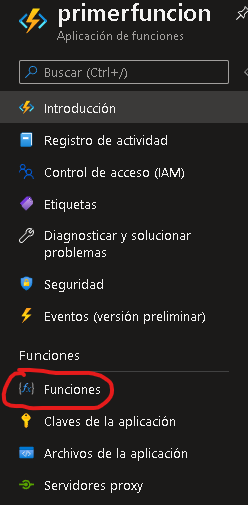
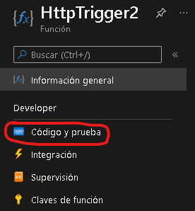
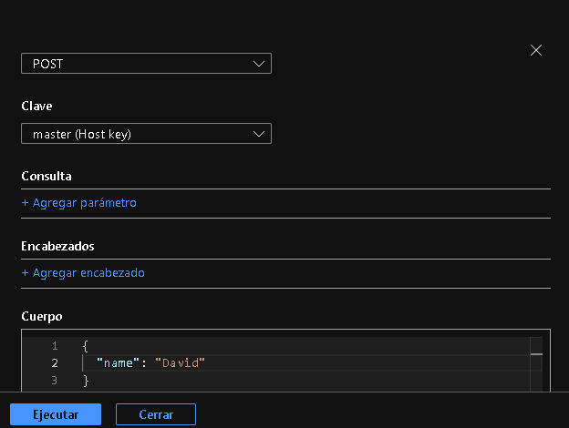
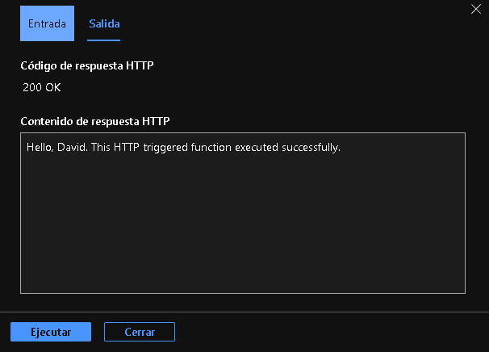

# Práctica 4 | **Azure Functions**

## Tabla de contenidos
- [Práctica 4 | **Azure Functions**](#práctica-4--azure-functions)
  - [Tabla de contenidos](#tabla-de-contenidos)
  - [Objetivo](#objetivo)
  - [Procedimiento](#procedimiento)

---
## Objetivo
Crear una aplicación de funciones en Microsoft Azure y ejecutarla a través de un trigger.

---
## Procedimiento

1. Acceder al [portal de Azure](portal.azure.com) y buscar _"Aplicación de funciones"_.
   
2. Creamos una aplicación de funciones al presionar el botón **Crear**.

3. En el campo **Suscripción** elegimos _Azure for students_.
4. En el campo **Grupo de recursos** elegimos el grupo de recursos que creamos en las prácticas pasadas, es decir, _sesion4_.

5. En el campo **Detalles de la instancia** escribimos el nombre de la instancia que será _primerfuncion_ y en _Pila del entorno en tiempo de ejecución_ elegimos **Node.js**.

6. En el campo **Región** elegimos _Central US_.

7. En el campo **Sistema operativo** elegimos la opción _Windows_.
8. En el campo **Tipo de plan** elegimos la opción _Consumo (sin servidor)_.

9. Finalmente damos click en **Revisar y crear** y esperamos a que se complete la implementación.

10. Nos dirigimos a la aplicación creada y nos dirigimos a **Funciones**.

11.  Damos click en **Crear** y en el campo **Entorno de desarrollo** seleccionamos _Desarrollar en el portal_. 
12.  En el campo **Selecionar una plantilla** selecionamos _HTTP trigger_ y damos click en **Crear**.
13.  Una vez creado el trigger nos dirigimos a **Código y prueba**.

14. Damos click en **Probar y ejecutar** y modificamos el cuerpo y damos click en **Ejecutar**.

15. Observaremos la ejecución del trigger al realizar un método POST.

